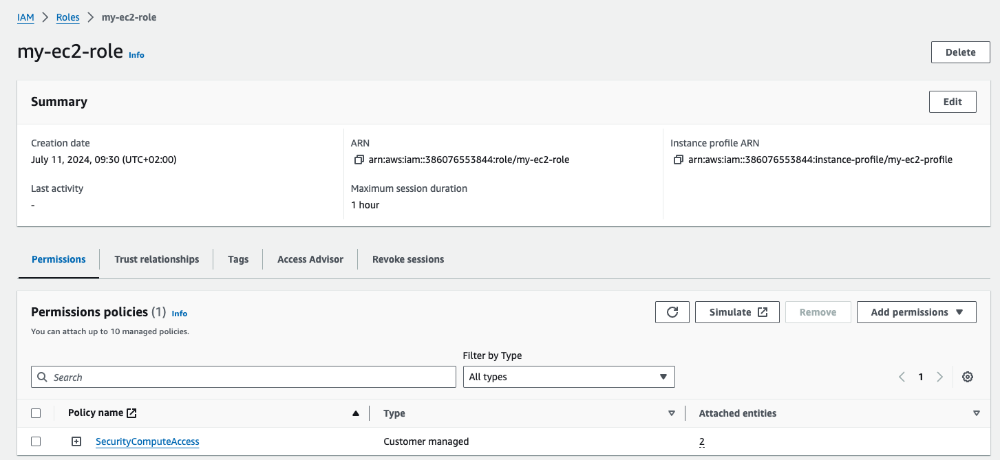
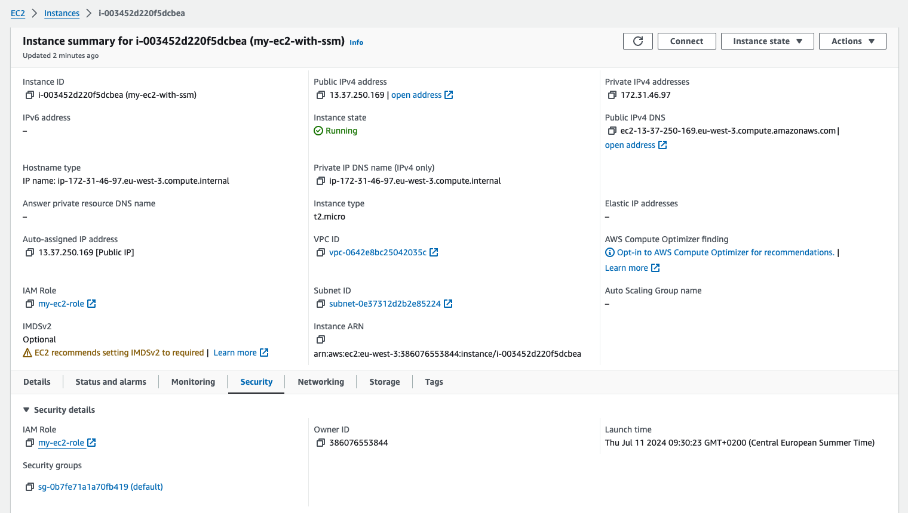
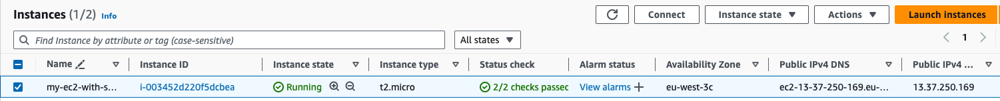
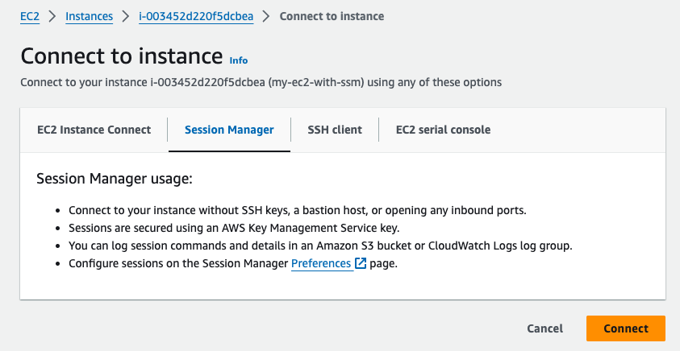
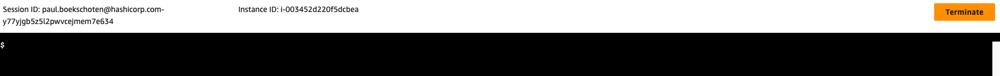

# Repository to show how to get Session Manager enabled on AWS with Terraform.

# Run the code

Initialise Terraform
```
terraform init
```

Provision the resources
```
terraform apply
```

# In AWS 

The created role `my-ec2-role` with the `SecurityComputeAccess` policy attached


The EC2 instance with the instance profile attached


## Open Session Manager

Under you EC2 instances, select the instance you want to connect to and click `Connect`


Select `Session Manager` and click `Connect`


You will get a prompt in a new tab.